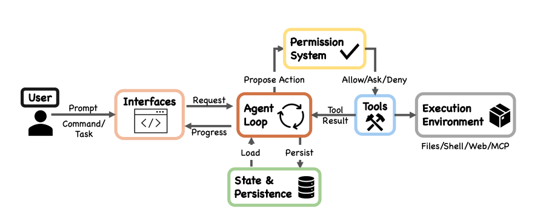
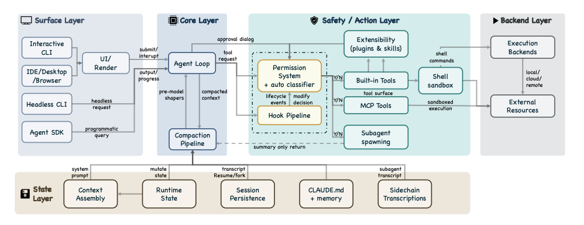
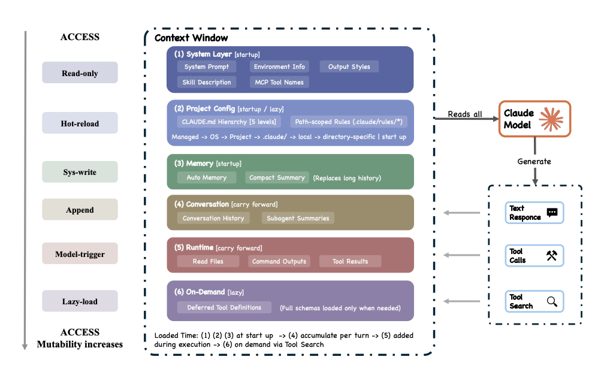
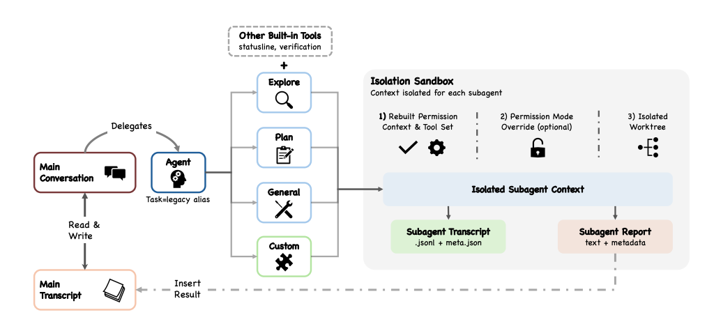
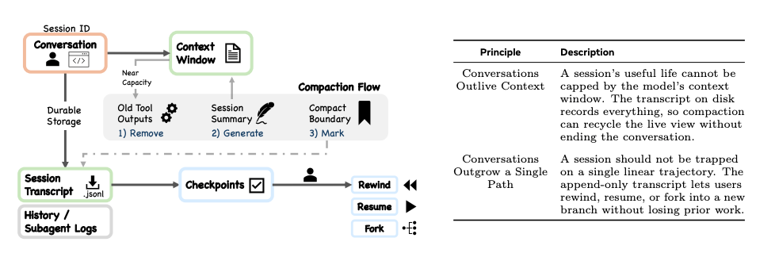

# AgentHarnessLab

Build Claude Code-like Agent Runtime from Scratch using Typescript Domain-Driven-Design

## References

#### [Dive into Claude Code: The Design Space of Today's and Future AI Agent Systems](https://arxiv.org/abs/2604.14228)

#### FIG1

High-level system structure of Claude Code. The system decomposes into seven functional components: user,
interfaces, the agent loop, a permission system, tools, state & persistence, and an execution environment. All entry
surfaces converge on the same agent loop.

#### FIG3

 Expanded layered architecture showing five subsystem layers: surface (Interactive CLI, Headless CLI, Agent
SDK, IDE/Desktop/Browser, UI/renderer), core (agent loop, compaction pipeline), safety/action (permission system
incl. auto-mode classifier, hook pipeline, extensibility, built-in tools, MCP tools, shell sandbox, subagent spawning),
state (context assembly, runtime state, session p

#### FIG6

Context construction and memory hierarchy. Sources converging on the context window include system
prompt, output styles, environment info, the CLAUDE.md hierarchy (managed through directory-specific), auto
memory, path-scoped rules, MCP tool names, deferred tool definitions via ToolSearch, conversation history, file reads,
command outputs, tool results, subagent summaries, and compact summaries.

#### FIG7

Subagent isolation and delegation architecture. The Agent tool dispatches to built-in subagents (Explore,
Plan, general-purpose) or custom subagents, each running in an isolated context with rebuilt permission context and
independent tool sets. The Agent tool dispatches along three axes: routing (teammate), isolation (remote, worktree),
and lifecycle (async, sync).

#### FIG8

Session persistence and context compaction. The diagram separates live session state (context window,
compaction) from durable storage (session transcripts, history.jsonl, subagent sidechains, checkpoints). Resume and
fork restore messages but not session-scoped permissions.

